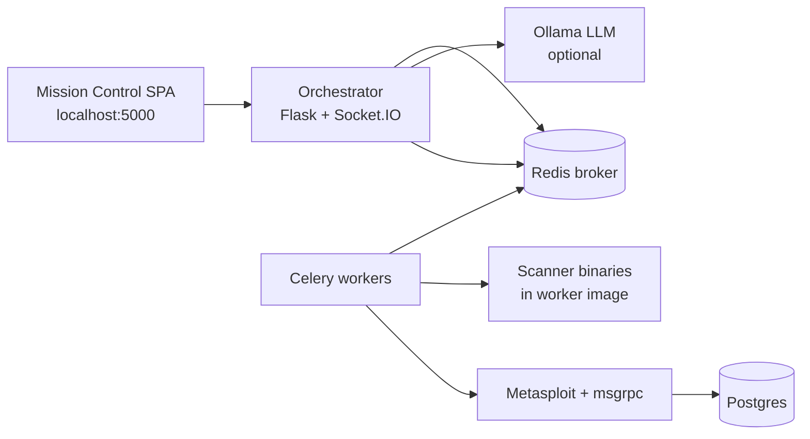

# Firebreak

Authorized security testing orchestrator. Firebreak runs scanners and Metasploit modules through Celery workers, drives missions from a local Mission Control UI (or APIs / MCP), and can adapt next steps with an optional local LLM.

**Only use against systems you are explicitly authorized to test.**

---

## Table of contents

1. [What it does](#what-it-does)
2. [Architecture](#architecture)
3. [Mission Control UI](#mission-control-ui)
4. [How a mission runs](#how-a-mission-runs)
5. [Playbooks](#playbooks)
6. [Installed tools](#installed-tools)
7. [AI Mode & MCP](#ai-mode--mcp)
8. [Active scanner API](#active-scanner-api)
9. [Proxy routing](#proxy-routing)
10. [Metasploit](#metasploit)
11. [Optional security features](#optional-security-features)
12. [Quick start](#quick-start)
13. [Configuration (`.env`)](#configuration-env)
14. [HTTP API overview](#http-api-overview)
15. [CLI](#cli)
16. [Development & tests](#development--tests)
17. [Troubleshooting](#troubleshooting)
18. [Further docs](#further-docs)

---

## What it does

Firebreak turns a **target** (hostname or URL) into a multi-phase job:

1. You submit a mission from Mission Control, CLI, or API.
2. The **orchestrator** loads a YAML playbook (or an AI plan) and enqueues Celery tasks.
3. **Workers** run tool wrappers (nmap, nuclei, sqlmap, Metasploit, …).
4. Results are stored (SQLite) and streamed back to the UI via Socket.IO + polling.
5. Optional **DecisionEngine** / **AI planner** can skip or add phases based on prior findings.

It is **not** a SaaS product: everything runs in Docker on your machine. The dashboard binds to **localhost only** (`127.0.0.1:5000`). Metasploit RPC and Postgres are **not** published to the host.

---

## Architecture



| Component | Role |
|-----------|------|
| **Orchestrator** | Dashboard, REST/MCP APIs, playbook / AI mission loops, job status |
| **Workers** | Execute `_TASK_MAP` Celery tasks (scanner wrappers + Metasploit) |
| **Redis** | Celery broker/backend, proxy settings, MCP sessions, audit buffer |
| **Metasploit** | MessagePack `msgrpc` + DB-backed workspace (internal network) |
| **PostgreSQL** | Metasploit database (internal only) |
| **Ollama** | Optional OpenAI-compatible LLM for AI Mode / aggressive decide |
| **SPA** | React Mission Control, built into `src/orchestrator/static/app` |

Compose files:

- Root: `docker compose up -d` (preferred)
- Alternate: `docker compose -f docker/docker-compose.yml up -d` (paths relative to `docker/`)

Optional Vault: `docker compose --profile vault up -d vault`

---

## Mission Control UI

Open [http://127.0.0.1:5000](http://127.0.0.1:5000).

**Focus Launch** layout (current UI):

| Area | What you do |
|------|-------------|
| **Website or host** | Enter `example.com` or a full URL |
| **Start** | Submits `POST /api/run` |
| **Options** (collapsed) | Stealth, Proxy, Smart plan |
| **Status** | Mission summary + progress |
| **Steps** | Playbook / AI phases and tools |
| **Activity** | Live event log (Socket.IO) |

### Options explained

| UI label | Behavior |
|----------|----------|
| **Stealth** | Off / Low / High → maps to WAF evasion profiles (`off`, `low`, `aggressive`) |
| **Proxy** | Route eligible HTTP tools through Oxylabs (or configured) worker proxy |
| **Smart plan** | AI Mode: adaptive planner instead of static YAML phases; optional goal; “Allow risky tools” for high-risk scanners |

There is no separate “Exploit Ops” console tab in the current SPA; Metasploit is driven via playbook/API tasks and `/api/metasploit/*`.

---

## How a mission runs

### Playbook mode (default)

1. UI or API calls `POST /api/run` with `target`, optional `use_proxy`, `proxy_protocol`, `evasion`.
2. Orchestrator loads `playbooks/complete_dark_arsenal.yaml` (or `PLAYBOOK_PATH`).
3. For each phase (respecting `depends_on` / `when`), it builds a Celery `group` or `chain` via `build_phase_workflow`.
4. Workers run wrappers; results are saved per phase; DecisionEngine may influence later phases.
5. Job state: `PENDING` → `STARTED` → `SUCCESS` / `FAILURE` on `/status/<task_id>`.

### AI Mode (`ai_mode: true`)

1. Same `/api/run` entrypoint with optional `nl_goal` and `confirm_high_risk`.
2. `run_ai_mission` loops: **plan → enqueue phase tools → collect → re-plan** (max steps).
3. Planner uses LLM when `FIREBREAK_LLM_BASE_URL` is set; otherwise a **heuristic** planner (recon → web checks → goal-driven tools).
4. High-risk tools run freely unless `FIREBREAK_AI_REQUIRE_CONFIRM=true`.
5. Phase timeouts continue with partial results instead of killing the whole mission when possible.

Web targets are normalized to **HTTPS** (and often `www` when redirects say so) to avoid ISP HTTP hijacks from residential networks.

---

## Playbooks

YAML under `playbooks/`:

| File | Purpose |
|------|---------|
| `complete_dark_arsenal.yaml` | **Default (UI/API)** — all 23 wrappers across recon → post-ex |
| `default.yaml` | Full-spectrum alternate (recon → vuln → conditional exploit/creds) |
| `aggressive.yaml` | Dynamic/conditional style steps for the dynamic compiler |
| `defensive_audit.yaml` | Lighter recon + vuln checks |
| `ultimate_aggression.yaml` | Heavier installed-tool chain |

Typical phase shape:

```yaml
phases:
  - name: recon
    tools:
      - tool: nmap
        args: ["-sV", "-p80,443", "-T4"]
    parallel: true
  - name: vulnerability_scan
    tools:
      - tool: nuclei
        args: ["-severity", "critical,high", "-silent"]
    depends_on: ["recon"]
    when: "vuln_found == True"   # optional DecisionEngine condition
```

`{{target}}` in args is substituted with the mission target.

Select a non-default playbook via API query: `POST /api/run?playbook=playbooks/defensive_audit.yaml`.

---

## Installed tools

Workers expose **23** Celery-mapped wrappers (`src/orchestrator/tasks.py` → `tools/wrappers/`):

| Category | Tools |
|----------|--------|
| Port / host | `nmap`, `masscan`, `rustscan`, `zmap` |
| Web recon | `whatweb`, `gobuster`, `ffuf`, `theharvester`, `nikto` |
| Vuln / inject | `nuclei`, `xsstrike`, `sqlmap` |
| Creds / hash | `hydra`, `john`, `hashcat` |
| Windows / AD helpers | `impacket`, `crackmapexec`, `responder`, `bloodhound` |
| Post-ex helpers | `winpeas`, `linpeas`, `sliver` |
| Exploit framework | `metasploit` (large module library via RPC — not 23 separate wrappers) |

Mission Control → **Options → Arsenal** lists every wrapper. **Probe workers** runs a Celery health check (`GET /api/tools`, `GET /api/tools/health`).

Use playbook `playbooks/complete_dark_arsenal.yaml` to exercise the full wired set in one mission.

Not every binary is equally mature in Docker (SYN scans, GPU hashcat, wireless, C2, etc. depend on host capabilities). Missing binaries return a structured `{ "error": "… not found" }` / `status` result rather than crashing the worker.

---

## AI Mode & MCP

### Mission Control Smart plan

Enable **Options → Smart plan**, optionally set a goal, then **Start**. Backend receives:

```json
{
  "target": "https://example.com",
  "ai_mode": true,
  "nl_goal": "prefer SQL injection",
  "confirm_high_risk": false,
  "use_proxy": false,
  "evasion": "aggressive"
}
```

### MCP façade

Model Context Protocol surface on the orchestrator (for agents / clients):

| Endpoint | Purpose |
|----------|---------|
| `POST /mcp` | JSON-RPC: `initialize`, `tools/list`, `tools/call` |
| `GET /mcp/sse` | SSE heartbeat |

Auth: `Authorization: Bearer <FIREBREAK_MCP_API_KEY>` or `X-API-Key`.

MCP tools include: `session_create`, `list_tools`, `run_tool`, `get_job_status`, `get_findings`, `list_sessions`, `suggest_next_phase`.

```bash
# Generate a key
python -c "import secrets; print(secrets.token_urlsafe(32))"
```

Recommended LLM (compose Ollama — **own Firebreak model**):

```bash
FIREBREAK_LLM_BASE_URL=http://ollama:11434/v1
FIREBREAK_LLM_API_KEY=ollama
FIREBREAK_LLM_BASE_MODEL=qwen2.5:7b
FIREBREAK_LLM_MODEL=firebreak
FIREBREAK_LLM_THINK=false
FIREBREAK_LLM_UNRESTRICTED=true
FIREBREAK_AI_REQUIRE_CONFIRM=false
```

Compose builds **`firebreak`** from `docker/ollama/Modelfile` on an open base (`qwen2.5:7b` by default). Training seeds live under `training/`. Alias CAI is **not** used.

Related APIs:

- `GET /api/ai/sessions`
- `GET /api/ai/audit/<session_id>`
- `POST /api/ai/plan` — dry-run next phase suggestion

---

## Active scanner API

Lightweight HTTPS-first probes (WAF/SQLi/XSS/path/open-redirect signals), separate from the full playbook:

| Method | Path | Purpose |
|--------|------|---------|
| `POST` | `/api/scan/start` | Start threaded scan job |
| `GET` | `/api/scan/status/<job_id>` | Poll job + findings |

Authorization:

- Default: allow + audit (`FIREBREAK_REQUIRE_AUTHZ=false`)
- Strict: set `FIREBREAK_REQUIRE_AUTHZ=true` and list hosts in `authorized_targets.json` (see `authorized_targets.example.json`)

Example:

```bash
curl -s -X POST http://127.0.0.1:5000/api/scan/start \
  -H 'Content-Type: application/json' \
  -d '{"target":"https://example.com"}'
```

---

## Proxy routing

When **Proxy** is on, HTTP-capable wrappers (sqlmap, ffuf, gobuster, nuclei, whatweb, nikto, hydra, xsstrike, …) receive proxy kwargs.

Configure via Mission Control **Options → Proxy → Proxy settings**, or `.env`:

- `OXYLABS_PROXY_HOST` / `PORT` / `PROTOCOL` / `USERNAME` / `PASSWORD`

Saving from the UI updates Redis + `.env` (and Kubernetes Secret/ConfigMap when in-cluster).

APIs: `GET|PUT|DELETE /api/proxy/settings`, `GET /api/proxy/status`, `POST /api/proxy/test`.

---

## Metasploit

Metasploit runs inside Docker with PostgreSQL and MessagePack **msgrpc** (not standalone `msfrpcd`). Healthcheck authenticates and requires a connected DB.

Playbook / task args example:

```yaml
- tool: metasploit
  args:
    - auxiliary/scanner/portscan/tcp
    - RPORTS=80,443
    - THREADS=10
```

`RHOSTS` is derived from the mission target unless set explicitly.

REST (under orchestrator):

- `GET /api/metasploit/health`
- `GET /api/metasploit/modules?q=…&type=…`
- `GET /api/metasploit/modules/<type>/<path>`
- `POST /api/metasploit/modules/run`
- `GET|DELETE /api/metasploit/jobs[/<id>]`
- `GET|DELETE /api/metasploit/sessions[/<id>]`
- `POST /api/metasploit/sessions/<id>/command`

Socket.IO: `msf_console_create` / `write` / `read` / `destroy`.

Credentials: `MSF_RPC_USER` / `MSF_RPC_PASSWORD` and Postgres vars in `.env`. The browser never receives RPC passwords.

---

## Optional security features

| Feature | Behavior |
|---------|----------|
| **Scoped WAF** | Blocks obvious injection on `/auth` and some `/api/proxy` traffic; **does not** block mission payloads on `/api/run` |
| **Rate limit** | Optional Flask-Limiter when installed; soft-disabled if missing |
| **Auth routes** | `/auth/local/login`, LDAP, OAuth stubs when configured |
| **Audit log** | Local/Redis-first; optional Splunk/webhook sinks |
| **Vault** | Soft-fail client; enable compose profile `vault` |
| **Aggressive APIs** | `/api/aggressive/*`, `/api/playbook/dynamic`, deception/scale helpers (best-effort / optional deps) |

---

## Quick start

```bash
cp .env.example .env
# Set strong secrets:
#   POSTGRES_PASSWORD=
#   MSF_RPC_PASSWORD=
#   FIREBREAK_MCP_API_KEY=   # optional but required for /mcp when enabled
# openssl rand -hex 24

docker compose up -d

# Wait for health
curl -s http://127.0.0.1:5000/health
curl -s http://127.0.0.1:5000/api/metasploit/health
```

Open the dashboard: [http://127.0.0.1:5000](http://127.0.0.1:5000)

CLI playbook run:

```bash
docker compose exec orchestrator \
  python -m orchestrator.cli \
  --target https://example.com \
  --playbook playbooks/complete_dark_arsenal.yaml
```

Rebuild the UI after frontend changes:

```bash
cd frontend && npm ci && npm run build
# assets land in src/orchestrator/static/app
```

---

## Configuration (`.env`)

Copy from `.env.example`. Never commit real `.env` files.

**Required for stack boot**

| Variable | Purpose |
|----------|---------|
| `POSTGRES_PASSWORD` | Metasploit DB |
| `MSF_RPC_PASSWORD` | msgrpc auth |

**Common optional**

| Variable | Purpose |
|----------|---------|
| `PLAYBOOK_PATH` | Default playbook (default `playbooks/complete_dark_arsenal.yaml`) |
| `FIREBREAK_MCP_API_KEY` | MCP auth |
| `FIREBREAK_LLM_BASE_URL` | e.g. `http://ollama:11434/v1` |
| `FIREBREAK_LLM_BASE_MODEL` | default `deepseek-v4-flash:cloud` (DeepSeek Instant) |
| `FIREBREAK_LLM_MODEL` | default `firebreak` (Modelfile persona over Instant) |
| `FIREBREAK_LLM_THINK` | default `false` (keeps planner JSON clean) |
| `FIREBREAK_LLM_UNRESTRICTED` | Aggressive system prompts + higher temperature (default true) |
| `FIREBREAK_AI_REQUIRE_CONFIRM` | Gate high-risk AI/MCP tools (default false) |
| `FIREBREAK_SQLI_INTENSITY` | sqlmap strategy: `off`/`low`/`medium`/`high`/`aggressive` |
| `FIREBREAK_SQLMAP_DNS_DOMAIN` | Optional OOB DNS domain for sqlmap |
| `FIREBREAK_LHOST` | Reverse payload callback IP (required for reliable shells) |
| `FIREBREAK_LHOST` | Reverse payload callback IP (reachable from target) |
| `FIREBREAK_LPORT_START` | Prefer listener ports from this value (default 4444) |
| `FIREBREAK_PAYLOAD_PREFER` | `reverse` (default) or `bind` |
| `OXYLABS_*` | Residential/datacenter proxy |
| `FIREBREAK_REQUIRE_AUTHZ` | Enforce `authorized_targets.json` for `/api/scan` |
| `SECRET_KEY` | Flask sessions |
| `VAULT_TOKEN` / `VAULT_ADDR` | Optional Vault |

---

## HTTP API overview

| Method | Path | Notes |
|--------|------|-------|
| `GET` | `/health` | Liveness |
| `GET` | `/ready` | Readiness (sqlite + optional ES/celery) |
| `GET` | `/metrics` | Prometheus |
| `GET` | `/api/playbook` | Default playbook JSON for UI Steps |
| `POST` | `/api/run` | Start playbook or AI mission |
| `GET` | `/status/<task_id>` | Job state, phases, AI steps, errors |
| `GET` | `/results?target=&job_id=` | Stored phase findings |
| `POST` | `/api/scan/start` | Lightweight active scan |
| `GET` | `/api/scan/status/<id>` | Scan job status |
| `*` | `/api/proxy/*` | Proxy config |
| `*` | `/api/metasploit/*` | Metasploit RPC façade |
| `*` | `/api/ai/*` | Plan / sessions / audit |
| `*` | `/api/aggressive/*` | Decide / execute / deception / scale |
| `*` | `/mcp` | MCP JSON-RPC |
| `*` | `/auth/*` | Login / status |

Socket.IO connects from the SPA for live Activity events.

---

## CLI

```bash
python -m orchestrator.cli --target <url> --playbook playbooks/default.yaml
```

Runs inside the orchestrator container (or locally with `PYTHONPATH=src` and Redis reachable).

---

## Development & tests

```bash
# Python (from repo root)
python -m venv .venv && source .venv/bin/activate
pip install -r requirements.txt -r requirements-dev.txt
PYTHONPATH=src pytest -q tests/unit tests/test_ai_planner.py tests/test_mcp_http.py

# Frontend
cd frontend && npm ci && npm test -- --run && npm run build
```

CI: `.github/workflows/ci.yml` runs unit tests + frontend vitest.

Package layout under `src/`:

```
src/
  orchestrator/   # Flask app, Celery tasks, AI, MCP package, scan API
  tools/          # wrappers, proxy, WAF evasion, SQLi strategy, payloads, CVE map
  scanner/        # lightweight VulnerabilityScanner + authz
  security/       # WAF, audit, vault, auth helpers
  workers/        # dynamic tool runner + scaling helpers
  utils/          # config, redis helpers, threat hints
  services/       # deception (honeypot) helpers
frontend/         # React + Vite Mission Control
playbooks/        # YAML missions
docker/           # Dockerfiles, vault config, patches
```

---

## Troubleshooting

| Symptom | What to check |
|---------|----------------|
| Dashboard blank / old UI | Rebuild SPA (`frontend/npm run build`), hard-refresh browser |
| `MSF_RPC_PASSWORD is required` | Fill `.env` and recreate compose |
| Metasploit unhealthy | `docker compose logs metasploit`; Postgres must be healthy first |
| AI mission “timed out” | Long tools (e.g. wide masscan) — bounded timeouts / stealth defaults; check worker logs |
| MCP `503` / unauthorized | Set `FIREBREAK_MCP_API_KEY` and send Bearer / `X-API-Key` |
| LLM unused | Confirm Ollama up (`curl 127.0.0.1:11434/api/tags`); heuristic planner still works without it |
| Proxy tools fail | Validate Oxylabs **proxy user** creds (not dashboard email); use Proxy settings → Test |
| Import errors after experimental edits | Prefer `PYTHONPATH=/app/src` imports (`orchestrator.*`, `tools.*`), not broken `src.*` shadows of packages |

Logs:

```bash
docker compose logs -f orchestrator worker
```

---

## Further docs

| Doc | Topic |
|-----|--------|
| [`docs/README.md`](docs/README.md) | Documentation index |
| [`docs/user_manual.md`](docs/user_manual.md) | Operator quick start |
| [`docs/api_reference.md`](docs/api_reference.md) | HTTP / MCP API |
| [`docs/developer_guide.md`](docs/developer_guide.md) | Contributor layout & tests |
| [`docs/waf_evasion.md`](docs/waf_evasion.md) | Outbound WAF evasion |
| [`docs/sql_injection.md`](docs/sql_injection.md) | SQLi → sqlmap strategy |
| `docs/superpowers/specs/2026-07-20-ai-mcp-orchestration-design.md` | AI + MCP design |
| `docs/superpowers/specs/2026-07-20-payload-strategy-design.md` | Payload LHOST/LPORT strategy |
| `src/tools/cve_exploit_map.py` | CVE + open-port → Metasploit map |
| `.env.example` | Full env reference |
| `authorized_targets.example.json` | Optional scan allowlist |

---

## License / responsibility

Operators are responsible for legal authorization, scope, and impact of every scan and exploit module. Prefer non-destructive auxiliaries unless engagement rules explicitly allow more.
