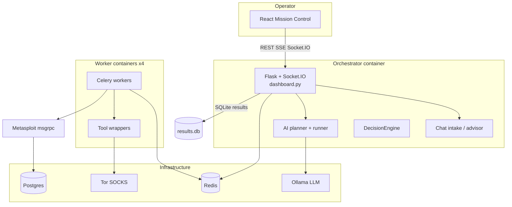

# Firebreak — Architecture

How the stack is composed, how data flows, and where logic lives in the codebase.

---

## System Diagram



---

## Docker Compose Services

| Service | Role |
|---------|------|
| **orchestrator** | Flask app, API, SPA static files, mission loops, chat |
| **worker** (×4) | Celery; runs tool wrappers; `NET_RAW` for SYN scans |
| **beat** | Scheduled learning / auto-train ticks |
| **redis** | Celery broker/backend, sessions, job mirror, MCP sessions |
| **postgres** | Metasploit database (internal only) |
| **metasploit** | `msgrpc` MessagePack RPC on internal port |
| **ollama** | Local LLM (OpenAI-compatible `/v1`) |
| **ollama-pull** | One-shot: pull base model + build `firebreak` Modelfile |
| **tor** | SOCKS proxy for dark-web OSINT |

Entry point: `python -m orchestrator.dashboard` (`src/orchestrator/dashboard.py`).

---

## Request & Mission Data Flow

### Playbook / AI mission

```
POST /api/run  (or chat launch)
  → missions service creates job_id
  → load YAML playbook OR run_ai_mission()
  → build_phase_workflow() → Celery group/chain
  → workers execute wrappers
  → save_phase_result() → SQLite
  → DecisionEngine.evaluate_phase() → optional follow-ons
  → job state mirrored to Redis (playbook_jobs)
  → Socket.IO + polling → MissionDetail UI
```

### Chat mission

```
POST /api/chat/missions/<id>/stream
  → intake.advisor_stream() (LLM tokens)
  → intake.detect_proposal() (plan + target + OSINT seeds)
  → draft stored on thread
  → operator confirms → POST .../launch
  → _execute_chat_mission() → same as /api/run with seed_plan
```

### MCP tool run

```
POST /mcp  (JSON-RPC run_tool)
  → mcp/actions.py enqueues Celery task
  → session-scoped audit
```

---

## State & Persistence

| Store | Location | Holds |
|-------|----------|-------|
| **Mission jobs** | Redis + in-memory `playbook_jobs` | Phase status, AI steps, errors |
| **Results** | SQLite (`FIREBREAK_DB_PATH`) | Per-phase tool output |
| **Decision state** | SQLite via DecisionEngine | Target/job context for `when:` conditions |
| **Authorized targets** | JSON (`AUTHORIZED_TARGETS_FILE`) | Engagement allowlist |
| **Chat threads** | File/redis via `chat/store.py` | Messages, drafts, proposals |
| **Custom tools** | Registry file + Redis | Operator-approved invented tools |
| **Audit** | Local / optional sinks | Security events |

Real-time updates: Flask-SocketIO (`dashboard.py`, `metasploit_socketio.py`); frontend hooks in `useMission.ts`.

---

## Backend Layout (`src/`)

```
src/
├── orchestrator/          # Core application
│   ├── dashboard.py       # Flask app, legacy routes, SPA serve
│   ├── tasks.py           # Celery tasks + _TASK_MAP (30 tools)
│   ├── decision_engine.py # Phase gating + exploit follow-ons
│   ├── api/               # REST blueprints (missions, chat, admin, osint, …)
│   ├── ai/                # planner, runner, llm, scaffolds, invention
│   ├── chat/              # intake, store, targets, web_search
│   ├── osint/             # seeds, breach providers/service
│   ├── mcp/               # JSON-RPC façade
│   ├── services/          # missions, results, blackboard
│   └── ml/                # auto_train, harvest
├── tools/                 # Wrapper implementations + inventory
│   └── wrappers/          # One module per CLI tool
├── scanner/               # Lightweight scanner + AuthorizationEnforcer
├── security/              # RBAC, auth, audit, WAF, vault
└── utils/                 # Shared helpers
```

### API blueprints (`orchestrator/api/`)

| Module | Responsibility |
|--------|----------------|
| `missions.py` | List missions, `POST /api/run`, stop/edit |
| `chat_missions.py` | Chat CRUD, stream, launch |
| `catalog.py` | Tool catalog + health probes |
| `authorized_targets.py` | Engagement allowlist CRUD |
| `osint_breach.py` | Breach provider status + lookup |
| `admin.py` | Users, orgs, ops settings |
| `dataset.py` | Training corpus contributions |
| `profile.py` | User profile |
| `blackboard.py` | Shared mission facts |
| `proxy.py` | Oxylabs proxy settings |

Additional routes on `dashboard.py`: Metasploit API, MCP, auth, scan API, aggressive helpers.

---

## Frontend Layout (`frontend/`)

```
frontend/src/
├── views/           # Page-level components
│   ├── Landing.tsx
│   ├── Missions.tsx      # Chat + manual + prompts hub
│   ├── MissionDetail.tsx
│   ├── Admin.tsx
│   ├── AiLab.tsx
│   └── Profile.tsx
├── components/      # MissionChat, OsintTargetPanel, …
├── api/client.ts    # Typed REST client
├── lib/             # Prompts, summaries, display helpers
└── routes.tsx       # React Router + RequireAuth
```

Built assets: `src/orchestrator/static/app/` (served by Flask).

---

## AI Planning Stack

| Component | File | Role |
|-----------|------|------|
| **LLM client** | `ai/llm.py` | Ollama / OpenAI-compat chat |
| **Planner** | `ai/planner.py` | Next-phase JSON; heuristic fallback |
| **Runner** | `ai/runner.py` | `run_ai_mission()` adaptive loop |
| **Scaffolds** | `ai/scaffolds.py` | Multi-model routing + consensus |
| **Invention** | `ai/invention.py` | Custom tools when standard ones fail |
| **Chat intake** | `chat/intake.py` | Advisor persona, `firebreak-plan` blocks, launch detection |

Posture filtering: `ai/posture.py` + `tools/attack_methods.py` restrict which tools the LLM may schedule.

---

## Playbooks

YAML under `playbooks/` defines static phases:

| File | Posture / use |
|------|----------------|
| `complete_dark_arsenal.yaml` | Default aggressive — full tool chain |
| `balanced_offense_defense.yaml` | Balanced |
| `defensive_audit.yaml` | Read-only style recon + vuln checks |

Mapping: `playbook_catalog.py`. Phases support `depends_on`, `when`, `parallel`, and `{{target}}` substitution.

---

## Notable Design Choices

1. **Local-first** — No multi-tenant cloud; operator owns data and infra.
2. **Secure-by-configuration** — RBAC and target authz default off for labs.
3. **Allowlist enforcement** — LLM may only schedule tools in `_TASK_MAP` (+ approved custom tools).
4. **OSINT separation** — Intelligence-only chat paths exclude port scans and exploitation tools.
5. **Redis job mirror** — Supports read replicas; explicit persist on mutations.
6. **Dual `/api/run`** — Legacy route on `dashboard.py` and RBAC-aware route on `api/missions.py` (enable RBAC consistently).

---

## Optional / Advanced Components

| Component | Notes |
|-----------|-------|
| **Vault** | Compose profile `vault`; soft-fail secret client |
| **K8s / Helm** | `k8s/`, `helm/` — KEDA worker scaling, Grafana |
| **Auto-train** | `ml/auto_train.py` — off by default; needs GPU pipeline |
| **Active scan API** | Lighter threaded scanner separate from full playbook |
