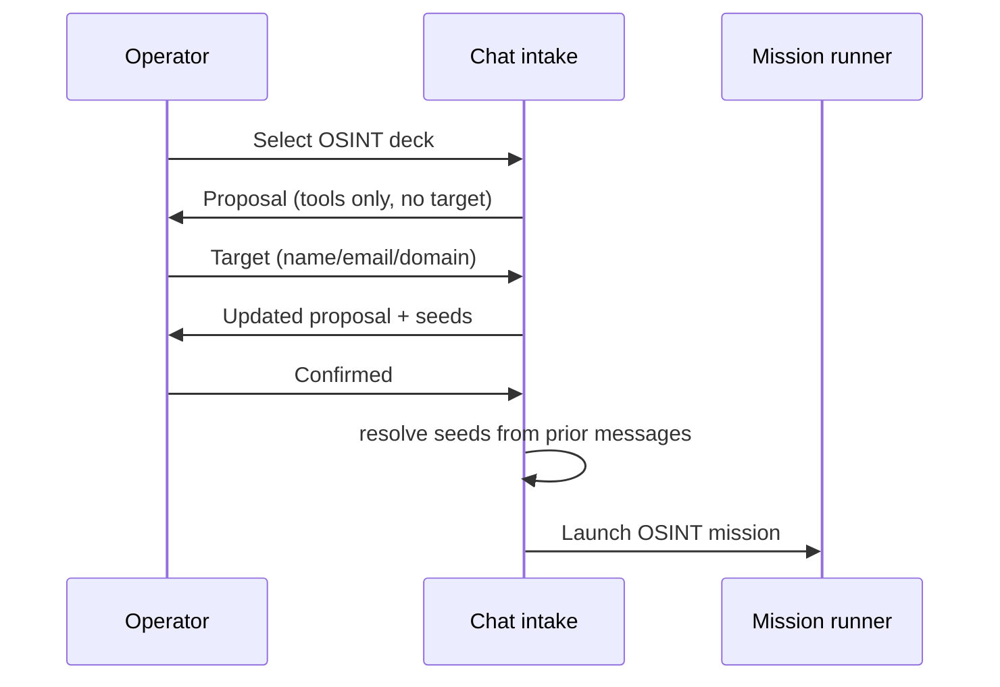

# Firebreak — OSINT & Breach Intelligence

How person-centric intelligence missions work: seed extraction, tooling, dark web, and breach providers.

---

## Overview

OSINT missions gather **public and licensed intelligence** about subjects (people, organizations, domains) without port scanning or exploitation. They are first-class citizens in chat and strike prompts, with a restricted tool allowlist.

---

## OSINT Seeds

Seeds are structured inputs extracted from operator chat or mission config.

| Seed type | Example | Used by |
|-----------|---------|---------|
| **email** | `user@corp.com` | theHarvester, breach_intel |
| **domain** | `corp.com` | subfinder, gau, theHarvester |
| **username** | `@handle` or `handle` | sherlock |
| **full_name** | `John Smith`, Arabic names | darkweb, breach search queries |
| **phone** | E.164 or local | breach providers (when configured) |

### Extraction pipeline

```
User message
  → osint/seeds.py: extract_followup_osint_seeds()
  → normalize (strip @, validate email/domain)
  → reject launch acks ("Confirmed", "Yes") via is_launch_ack_message()
  → resolve_osint_seeds_for_chat() walks thread for target on confirm
  → apply_osint_seeds_to_proposal() merges into firebreak-plan
```

### Arabic / Unicode names

Intake preserves full Unicode names for OSINT subjects. Launch acknowledgements in English do not overwrite a previously supplied Arabic name target.

---

## OSINT Tool Chain

Typical OSINT-only phase (parallel where safe):

| Tool | Function |
|------|----------|
| **theharvester** | Emails, hosts, URLs from public sources; `--seeds` mode skips redundant target flags |
| **subfinder** | Passive subdomains for domain seeds |
| **gau** | Historical URLs from AlienVault/Wayback-style archives |
| **sherlock** | Username presence across social platforms |
| **httpx** | Live URL probing (when URLs discovered) |
| **whatweb** | Tech stack on discovered sites |
| **katana** | Crawl discovered web assets |
| **darkweb** | Tor SOCKS search for name/email mentions |
| **breach_intel** | Credential breach lookups via configured providers |

Tools **excluded** from OSINT-only missions: nmap, masscan, sqlmap, metasploit, hydra, etc.

---

## Two-Turn Chat Flow

OSINT strike decks often omit a default target so operators supply scope explicitly:



**Bug fix (2026):** "Confirmed" / "Yes" are launch acks, not `@confirmed` / `@yes` usernames.

---

## Dark Web Search

| Component | Detail |
|-----------|--------|
| **Worker task** | `run_darkweb_task` in `tasks.py` |
| **Network** | Routes via `tor` service (SOCKS5) |
| **Input** | Name, email, or keyword seeds |
| **Output** | Normalized mentions + source hints in phase results |

Requires Tor container healthy in `docker compose`.

---

## Breach Intelligence

Commercial API keys power breach lookups with **operator-facing branding** (not raw vendor names in UI).

| Provider env | UI name | Module |
|--------------|---------|--------|
| DeHashed API | **Breach Vault** | `osint/breach_providers/` |
| LeakCheck API | **Leak Radar** | `osint/breach_providers/` |

Central service: `osint/breach_service.py` + `osint/breach_branding.py`.

### Behavior

- Queries run in worker via `breach_intel` Celery task.
- Results: breached emails, partial passwords/hashes (provider-dependent), source metadata.
- Missing keys: task skips gracefully; mission continues with other OSINT tools.

### API surface

- `GET /api/osint/breach/status` — provider availability
- Lookup endpoints documented in [api_reference.md](api_reference.md)

---

## Frontend: OSINT Target Panel

`OsintTargetPanel` on mission detail shows:

- Resolved seeds before/after launch
- Per-seed type icons
- Breach result summaries when available

Chat side: `MissionChat.tsx` renders proposal cards with seed preview before confirm.

---

## Strike Prompts & Templates

Defined in `frontend/src/lib/prompts.ts` (and backend catalog where mirrored):

| Template class | Target in prompt? | Next step |
|----------------|-------------------|-----------|
| OSINT person deck | No | Operator sends name/handle |
| OSINT domain deck | Optional | Operator confirms domain |
| Full pentest prompts | Often yes | Standard confirm flow |

Backend mirrors OSINT restrictions in `apply_osint_seeds_to_proposal()` and posture tool filters.

---

## Authorization

When `FIREBREAK_REQUIRE_AUTHZ=1`:

- Domain/email targets must align with `authorized_targets.json` entries.
- Person-name OSINT may require explicit operator approval patterns (org policy dependent).

See [SECURITY_AND_AUTH.md](SECURITY_AND_AUTH.md).

---

## Worker Dependencies

OSINT CLI tools installed in `docker/worker.Dockerfile`:

| Binary | Version note |
|--------|--------------|
| subfinder | Passive DNS |
| gau | tar.gz release (linux arm64/amd64) |
| sherlock | Python / pip bundle |
| theHarvester | Python module |
| httpx, katana | ProjectDiscovery stack |

Rebuild workers after Dockerfile changes:

```bash
docker compose build worker && docker compose up -d worker
```

---

## Testing

| Test file | Covers |
|-----------|--------|
| `tests/test_osint_seeds.py` | Seed extract, ack rejection, thread resolve |
| `tests/test_chat_plan_execute.py` | OSINT confirm keeps full-name target |

---

## Related

- [MISSION_AND_CHAT.md](MISSION_AND_CHAT.md) — Chat launch pipeline
- [FEATURES.md](FEATURES.md) — Full tool list
- [USER_JOURNEYS.md](USER_JOURNEYS.md) — Operator OSINT journey
