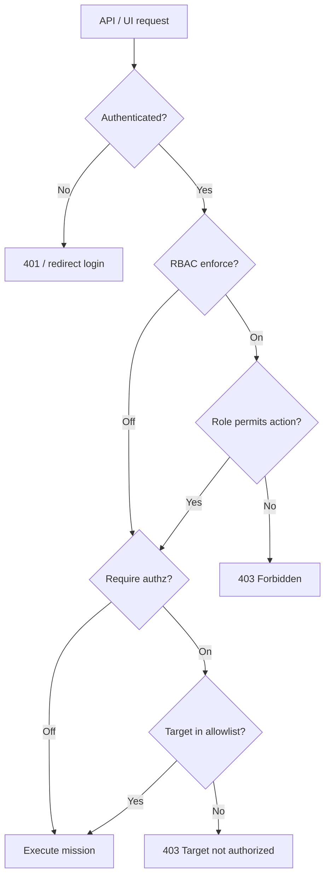

# Firebreak — Security & Authorization

Identity, roles, engagement authorization, and audit behavior.

---

## Two Independent Layers

Firebreak separates **who you are** from **what you may scan**.

---

## Authentication

### Local accounts

- Signup/login via `auth_routes.py`
- Session cookie for SPA (`AuthProvider`, `RequireAuth`)
- Password hashing via standard Werkzeug/security utilities

### Auth0 / OIDC (optional)

Configure in `.env`:

- `AUTH0_DOMAIN`, `AUTH0_CLIENT_ID`, `AUTH0_CLIENT_SECRET`, etc.
- Mission Control **Auth** panel shows SSO when enabled

### Default lab mode

With RBAC off, a single local operator session is sufficient for all API routes.

---

## RBAC (Role-Based Access Control)

| Env | Default | Effect |
|-----|---------|--------|
| `FIREBREAK_RBAC_ENFORCE` | `0` (off) | All authenticated users have full API access |
| `FIREBREAK_RBAC_ENFORCE` | `1` (on) | Routes check role decorators |

### Roles

| Role | Typical permissions |
|------|---------------------|
| **admin** | Users, orgs, authorized targets, ops settings, all missions |
| **operator** | Run/stop missions, chat, catalog read |
| **viewer** | Read missions and results; no launch |

Implementation: `src/security/rbac.py`, route decorators on `api/admin.py`, `api/missions.py`, etc.

### Pro edition

SSO + RBAC packaging is marketed under **Pro** (`FIREBREAK_EDITION=pro`) but uses the same code paths.

---

## Engagement Authorization (Target Allowlist)

| Env | Default | Effect |
|-----|---------|--------|
| `FIREBREAK_REQUIRE_AUTHZ` | `0` (off) | Any target string accepted |
| `FIREBREAK_REQUIRE_AUTHZ` | `1` (on) | Target must match `authorized_targets.json` |

### Allowlist file

- Path: `AUTHORIZED_TARGETS_FILE` (see `.env.example`)
- Managed via Admin UI or `api/authorized_targets.py`
- Entries may include hostnames, CIDRs, URLs per org policy

### Enforcement point

`src/scanner/authorization.py` — `AuthorizationEnforcer` called before:

- `POST /api/run`
- Chat mission launch
- MCP `run_tool`

Returns clear 403 JSON for out-of-scope targets.

---

## Audit Logging

Security-relevant events recorded for Mission Control **Audit** panel:

| Event type | Examples |
|------------|----------|
| Auth | Login, logout, failed login |
| Mission | Launch, stop, target blocked |
| Scaffold | Model disagreement, fallback used |
| Dataset | CC-BY contribution submitted |
| Admin | User role change, target list edit |

Sink configuration varies by deployment; local JSON/SQLite is default.

---

## Network & Deployment Hardening

| Control | Detail |
|---------|--------|
| **Bind address** | Dashboard defaults `127.0.0.1:5000` |
| **Postgres** | Not published to host; Metasploit internal only |
| **MSF RPC** | Password from `MSF_RPC_PASSWORD` |
| **Secrets** | `.env` not committed; optional Vault profile |
| **Tor** | Internal network only; workers use SOCKS for darkweb |

---

## WAF Evasion & Proxy

Not authentication, but affects scan footprint:

- **Evasion profiles** on wrappers (aggressive/normal)
- **Oxylabs proxy** for selected web tools when credentials set

Operators remain responsible for authorization scope regardless of stealth settings.

---

## MCP Session Security

- MCP sessions scoped in Redis with TTL
- Tool invocations audited with session id
- Same authorization hooks as HTTP when authz enabled

---

## Recommended Production Checklist

1. Set strong `POSTGRES_PASSWORD`, `MSF_RPC_PASSWORD`, session secret.
2. Enable `FIREBREAK_RBAC_ENFORCE=1` and assign least-privilege roles.
3. Enable `FIREBREAK_REQUIRE_AUTHZ=1` and populate allowlist before engagements.
4. Configure Auth0/OIDC for enterprise identity.
5. Keep dashboard off public interfaces or place behind VPN/reverse proxy with TLS.
6. Review audit log after each engagement.

---

## Related

- [APP_OVERVIEW.md](APP_OVERVIEW.md) — Security summary
- [USER_JOURNEYS.md](USER_JOURNEYS.md) — Admin journey
- [../README.md](../README.md) — Env variable reference
