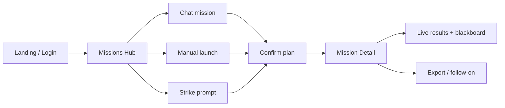

# Firebreak — User Journeys

How operators move through the UI and APIs to run authorized engagements.

---

## Journey Map



---

## 1. First Visit & Authentication

### Landing (`/`)

Public marketing page: product positioning, pricing hooks, links to signup/login.

### Signup / Login (`/signup`, `/login`)

- **Local auth:** Email + password; session cookie for API calls.
- **Auth0:** When `AUTH0_*` env vars are set, redirect to IdP.
- **RequireAuth:** Protected routes redirect unauthenticated users to login with return URL.

After login, default destination is **Missions** (`/missions`).

---

## 2. Missions Hub (`/missions`)

Central workspace with three launch paths:

### A. Chat mission (recommended for NL goals)

1. Start or select a chat thread.
2. Describe intent in natural language, or pick an **OSINT deck** template.
3. Advisor streams a reply; may include a `firebreak-plan` proposal (target, posture, tools).
4. For OSINT decks: send the **target in the next message** (name, email, domain, `@username`).
5. Reply **Confirmed** / **Yes** / **Launch** — system resolves target from thread history (not the ack word).
6. Mission launches; UI navigates to mission detail.

### B. Manual launch (Focus Launch)

Classic form controls:

| Field | Effect |
|-------|--------|
| Target | Hostname, URL, or IP in scope |
| Posture | `balanced` / `aggressive` / `defensive` |
| Playbook | YAML mission file |
| Stealth | WAF evasion profile |
| AI mode | Enable adaptive LLM loop |
| NL goal | Extra objective text for planner |

Submit → `POST /api/run` → redirect to `/missions/:id`.

### C. Strike prompts

One-click cards from `frontend/src/lib/prompts.ts`:

- Recon sweeps, web app tests, AD paths, **OSINT-only** decks (no nmap/sqlmap).
- Clicking a prompt may pre-fill chat or launch depending on template type.

---

## 3. Mission Detail (`/missions/:id`)

Live engagement view:

| Panel | Operator action |
|-------|-------------------|
| **Status header** | See phase progress, stop mission |
| **Activity feed** | Socket.IO stream of tool start/finish |
| **Phase results** | Expand raw output per tool |
| **OSINT target panel** | Review seeds (emails, names, handles) when applicable |
| **Blackboard** | Read/write shared facts (`findings`, `hardening`, …) |
| **Metasploit console** | When MSF modules run, interactive console via Socket.IO |
| **Summary** | Post-run defense recommendations + markdown export |

Polling + websockets keep the page updated without refresh.

---

## 4. AI Lab (`/ai-lab`)

For model operators and dataset contributors:

| Panel | Journey |
|-------|---------|
| **Firebreak model** | View primary/fallback scaffold health, latency, cost |
| **Marketplace** | Browse scaffold recipes; Pro: register OpenAI-compat endpoints |
| **Refresh** | Re-probe model availability |
| **Dataset contribute** | Filter by posture → load all → submit CC-BY pairs |
| **Blackboard** | Cross-mission shared state (read-focused here) |
| **Audit** | Recent security and scaffold events |

Typical flow: verify Ollama/scaffold health → contribute training examples → return to missions with AI mode enabled.

---

## 5. Profile (`/profile`)

Operator preferences and account metadata (display name, settings persisted via profile API).

---

## 6. Admin (`/admin`)

Requires **admin** role when RBAC is enforced.

| Task | UI path |
|------|---------|
| Manage users | Create, disable, assign roles |
| Authorized targets | Add/remove engagement allowlist entries |
| Org settings | Pro deployment hooks |
| Audit review | Security event log |

When `FIREBREAK_REQUIRE_AUTHZ=1`, operators cannot scan targets not on this list.

---

## 7. API-Only / Headless Journeys

### CLI playbook

```bash
python -m orchestrator.cli run \
  --playbook playbooks/complete_dark_arsenal.yaml \
  --target https://lab.example \
  --posture aggressive
```

### REST

```bash
curl -X POST http://127.0.0.1:5000/api/run \
  -H "Content-Type: application/json" \
  -d '{"target":"10.0.0.5","playbook":"complete_dark_arsenal.yaml","posture":"aggressive"}'
```

### MCP agent

External client opens MCP session → `list_tools` → `run_tool` with authorized target → polls job status.

See [api_reference.md](api_reference.md).

---

## 8. OSINT-Specific Journey

Detailed in [OSINT_INTEL.md](OSINT_INTEL.md). Short path:

1. Choose **OSINT deck** strike prompt or ask chat for "OSINT on …".
2. If template is target-free, send target as **follow-up message** (supports Arabic full names).
3. Confirm launch — ack words do not become `@confirmed` usernames.
4. Mission runs: theHarvester, subfinder, sherlock, gau, darkweb, breach_intel (as planned).
5. Review seeds panel + breach results on mission detail.

---

## 9. Defensive / Audit Journey

1. Set posture **defensive** or pick `defensive_audit.yaml`.
2. Disable or limit AI risky tools if desired.
3. Run mission — emphasis on nuclei/nikto/whatweb style checks.
4. Read **Defense recommendations** in summary.
5. **Export markdown** for remediation tracking.

---

## 10. Error & Block Paths

| Situation | Operator experience |
|-----------|---------------------|
| Target not authorized | 403 with message to add target in Admin |
| RBAC denied | 403 on API; UI hides admin actions |
| LLM unavailable | Heuristic plan or clear error in chat |
| Worker failure | Phase marked failed; error in activity feed |
| Missing breach API keys | Breach intel skipped; status in OSINT panel |

---

## Related Docs

- [user_manual.md](user_manual.md) — Control reference and troubleshooting
- [MISSION_AND_CHAT.md](MISSION_AND_CHAT.md) — Chat agent internals
- [APP_OVERVIEW.md](APP_OVERVIEW.md) — Product summary
